# RFC-0001: Chronos — Personal Context Engine

> **Status:** Draft — Open for Review  
> **Author:** Engineering Team  
> **Date:** 2026-03-20 (Revised)  
> **Classification:** Internal Engineering RFC  
> **Related:** [Idea Proposal 0001](../idea/0001.md) · [Skills Index](../reference/0001-skills-index.md)

---

## Executive Summary

Chronos is a **local-first operating-system context engine** that acts as a digital photographic memory. It silently captures the user's screen activity, translates visual context into structured semantic data using local AI inference, and stores the results in an embedded database that supports instant natural-language retrieval.

**No pixel, no model weight, no query, and no inference result ever leaves the user's hardware.**

The system serves knowledge workers who lose an estimated 20% of their work week reconstructing information they have already seen — a closed browser tab, a Slack thread, a chart from a video call. Chronos eliminates this friction with a four-stage pipeline: **Capture → Vision → Synthesis → Retrieval**, all running on commodity hardware without GPU requirements for the baseline experience.

> *"The AI that remembers everything, without anyone else knowing."*

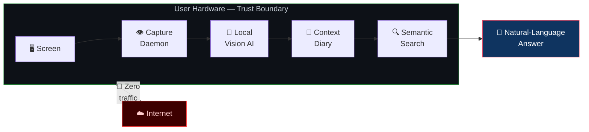

### What Chronos Is — and Is Not

| ❌ Chronos Is NOT | ✅ Chronos IS |
|---|---|
| A keylogger or spyware | A personal memory assistant under full user control |
| A cloud service that stores your data | A 100% local engine — data never leaves the machine |
| A raw screen recorder | An intelligent visual-context translator |
| A Microsoft Recall clone | A secure, open-source, privacy-first alternative |
| A monolithic binary | A trait-decoupled, testable, modular Rust workspace |

---

## Table of Contents

1. [Motivation & Market Context](#1-motivation--market-context)
2. [Design Principles](#2-design-principles)
3. [System Architecture](#3-system-architecture)
4. [Component Deep Dive](#4-component-deep-dive)
5. [Data Pipeline & Temporal Model](#5-data-pipeline--temporal-model)
6. [Data Model & Storage Budget](#6-data-model--storage-budget)
7. [Security & Privacy Model](#7-security--privacy-model)
8. [Local AI Strategy & Crate Selection](#8-local-ai-strategy--crate-selection)
9. [Concurrency Model & Runtime](#9-concurrency-model--runtime)
10. [User Interfaces](#10-user-interfaces)
11. [Competitive Analysis](#11-competitive-analysis)
12. [Roadmap & Evolution](#12-roadmap--evolution)
13. [Risk Matrix & Mitigations](#13-risk-matrix--mitigations)
14. [Appendix A — Architectural Decision Records](#appendix-a--architectural-decision-records)
15. [Appendix B — Privacy Compliance Matrix](#appendix-b--privacy-compliance-matrix)
16. [Appendix C — Glossary](#appendix-c--glossary)

---

## 1. Motivation & Market Context

### The Problem

Knowledge workers lose an average of **20% of their work week** searching for information they *know* they have seen. The average professional context-switches **400 times per day** across applications, tabs, chat threads, and meeting screens. Retrieving a specific piece of information from this stream currently requires either perfect note-taking discipline or raw luck.

### The Cloud Cost Trap

Sending 1 frame every 10 seconds to a proprietary vision API (e.g., GPT-4o, Claude) costs approximately:

| Parameter | Value |
|---|---|
| Frames per 8-hour workday | ~2,880 |
| Average cost per image inference | ~$0.005 |
| Daily cost per user | ~$14.40 |
| **Monthly cost per user** | **~$300+** |

This makes any cloud-dependent approach economically non-viable for a consumer or SMB product. Chronos eliminates this cost entirely by running inference on the user's own hardware with open-weight quantized models.

### Competitive Landscape

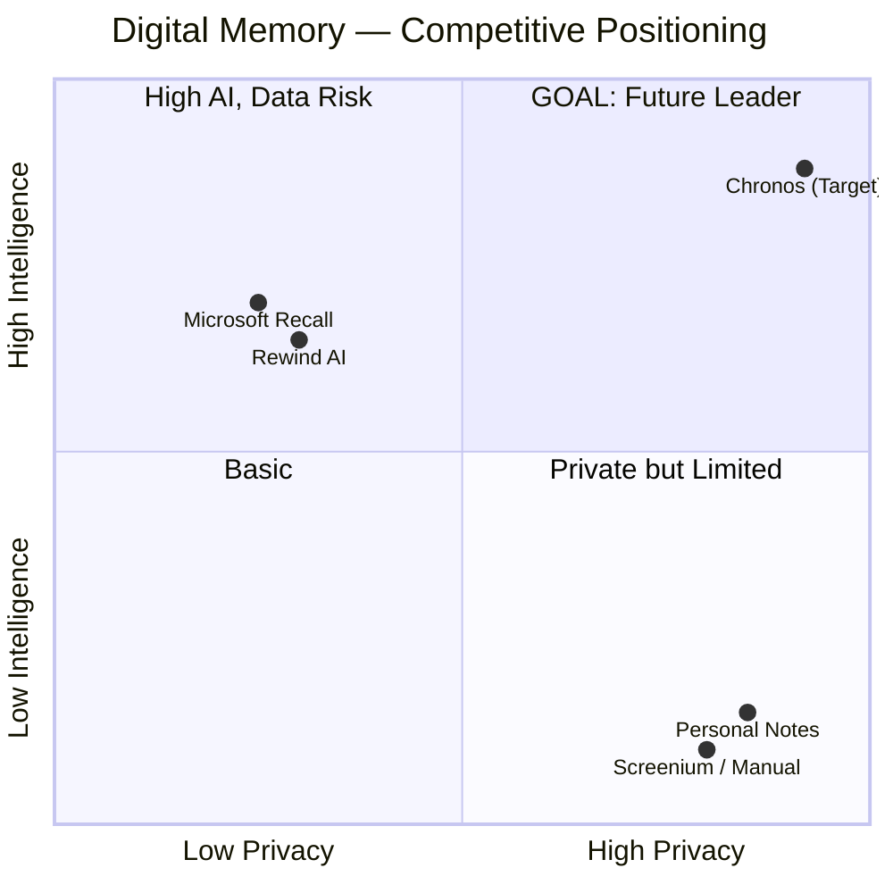

Chronos targets the upper-right quadrant: **maximum intelligence with maximum privacy**, a position no current product occupies.

---

## 2. Design Principles

Every technical decision is evaluated against these six principles. When principles conflict, the order below indicates priority.

| # | Principle | Contract | Technical Implication |
|---|---|---|---|
| 1 | 🔒 **Privacy-First** | Data MUST NOT leave the user's hardware | Zero outbound HTTP; all inference on `localhost` |
| 2 | 🪶 **Invisibility** | The system MUST be imperceptible during normal use | Adaptive capture rate; no CPU/SSD thrashing; ring buffer in RAM |
| 3 | 🧱 **Local-First** | The system MUST work 100% offline | Embedded SQLite; local models via Ollama; zero cloud deps |
| 4 | 🔌 **Modularity** | Every component MUST be swappable behind a trait | `ImageCapture`, `VisionInference`, `TextSynthesizer`, `EmbeddingProvider` |
| 5 | ⚡ **Efficiency** | Resource usage MUST scale with hardware | In-RAM buffers; quantized 4-bit models; adaptive throttling |
| 6 | 🧪 **Testability** | Core logic MUST be testable without GPU or screen | Mock implementations for all trait boundaries |

> **Architecture note:** The MUST/SHOULD/CAN language follows [RFC 2119](https://datatracker.ietf.org/doc/html/rfc2119) conventions. This is not accidental — it enforces the gravity of each guarantee.

---

## 3. System Architecture

Chronos is organized as four layers in a **streaming-to-batch pipeline**, each decoupled by Rust `trait` boundaries. This design enables independent testing, model swapping, and future parallelization.

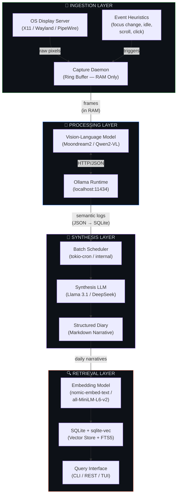

### Layer Contracts (Trait Boundaries)

Each layer communicates exclusively through Rust `trait` interfaces, following the [Hexagonal Architecture](https://alistair.cockburn.us/hexagonal-architecture/) pattern. This is the core testability strategy.

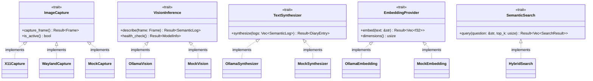

> **Go → Rust mental model:** These Rust traits correspond directly to Go interfaces. The difference: Go interfaces are satisfied implicitly (structural typing), while Rust traits require explicit `impl Trait for Type`. The Rust compiler guarantees at compile time that every concrete type satisfies the full contract, including associated types and lifetimes — zero runtime surprises.

---

## 4. Component Deep Dive

### 4.A — Capture Daemon (Ingestion Layer)

The Capture Daemon is the system's eye. It acquires screen frames, compresses them in memory, and forwards them to the vision worker via an async channel.

| Aspect | Decision | Rationale |
|---|---|---|
| **I/O** | Zero disk writes; circular ring buffer in RAM | Prevent SSD wear; no forensic traces of raw pixels |
| **Trigger mode** | Adaptive: 1 frame/30s idle → up to 2 fps active | Balance between context coverage and CPU load |
| **Concurrency** | Dedicated OS thread via `std::thread::spawn` | Screen capture APIs are blocking syscalls; must not block the Tokio runtime |
| **Format** | In-memory JPEG (80% quality) via `image` crate | ~30–60 KB per frame; fast encode; sufficient for VLM |
| **Buffer** | Fixed-capacity `VecDeque<Frame>` (configurable, default 64 frames) | Bounded memory; oldest frames dropped when full |
| **Bridge to async** | `tokio::sync::mpsc::Sender` | Sends frames from the OS thread into the Tokio runtime |

#### Edge Cases & Mitigations

| Edge Case | Risk | Mitigation |
|---|---|---|
| Screen locked / display off | Wasted captures; potential privacy leak of lock-screen | Query `org.freedesktop.ScreenSaver` D-Bus interface; pause capture when locked |
| Multi-monitor | Only primary screen captured | Step 1: primary only. Step 2: configurable per-monitor capture |
| Wayland compositor restrictions | `wl_output` screenshot requires portal | Use `xdg-desktop-portal` `org.freedesktop.portal.Screenshot` for Wayland |
| Ring buffer full, VLM slow | Frame loss | By design — frames are ephemeral. Log a metric for dropped-frame rate |
| Very high activity burst (2 fps) | CPU spike | Cap at configurable `max_fps`; JPEG compression is ~1ms on modern CPUs |

> **Go → Rust mental model:** In Go, you'd have a goroutine with a `chan []byte` and `select` timeout. In Rust, we use `std::thread::spawn` for the blocking capture loop (analogous to Go's goroutine), and `tokio::sync::mpsc` as the channel (analogous to Go's `chan`). The key difference: the Rust compiler *enforces* that `Frame` ownership is transferred cleanly — no data races by construction, not by convention.

---

### 4.B — Edge Vision Worker (Processing Layer)

The Vision Worker receives frames from the capture daemon and sends each frame to a locally running VLM via Ollama's HTTP API. The VLM returns a structured semantic description.

| Aspect | Decision | Rationale |
|---|---|---|
| **Model** | Quantized VLM (4-bit): Moondream2 (~1.8B), Qwen2-VL (~2B), or LLaVA-Phi-3 | Smallest models that produce usable descriptions on consumer GPUs |
| **Runtime** | Ollama via plain HTTP (`localhost:11434`) | No proprietary SDK; pure HTTP; JSON in/out. Easy to swap models |
| **Throttling** | Back-pressure via bounded channel + GPU utilization check | If `mpsc::Receiver` backlog > threshold, skip frames |
| **Output** | Structured JSON: `{ timestamp, app, window_title, action, context }` | Compact; parse-friendly; directly insertable into SQLite |
| **HTTP client** | `reqwest` crate with `rustls` (no OpenSSL) | Compile-time linked TLS; no system dependency; connects only to `localhost` |
| **Timeout** | Configurable per-frame timeout (default 10s) | Prevent one slow inference from stalling the entire pipeline |

#### VLM Bottleneck Analysis

The VLM is the most expensive component in the pipeline. Understanding its performance envelope is critical:

| Hardware | Model | Tokens/sec | Time per frame | Max throughput |
|---|---|---|---|---|
| CPU only (8-core) | Moondream2 Q4 | ~8 tok/s | ~15–25s | ~3 frames/min |
| GTX 1660 (6 GB) | Moondream2 Q4 | ~25 tok/s | ~5–8s | ~8 frames/min |
| RTX 3060 (12 GB) | Moondream2 Q4 | ~45 tok/s | ~3–4s | ~15 frames/min |
| RTX 4090 (24 GB) | Qwen2-VL Q4 | ~80 tok/s | ~2s | ~30 frames/min |

> **Implication:** On CPU-only hardware, VLM processing is the bottleneck — not capture. The adaptive capture rate MUST be capped at or below the VLM's throughput capacity. The system detects this dynamically: if the `mpsc` channel depth consistently exceeds a configurable threshold (default: 8), the capture daemon reduces its rate.

#### Prompt Engineering

The VLM prompt is critical for output consistency. The system uses a fixed, versioned prompt template:

```
You are a screen context analyzer. Describe what the user is doing in this screenshot.
Output ONLY valid JSON with these fields:
- "application": the app name visible on screen
- "window_title": the window title text
- "action": what the user appears to be doing (1 sentence)
- "context": key information visible on screen (2-3 sentences)

Be factual. Do not speculate about intent.
```

> **Edge case:** VLMs occasionally produce malformed JSON. The worker implements a two-tier parser: (1) `serde_json::from_str` strict parse, (2) regex-based field extraction as fallback. Unparseable responses are logged as errors and discarded — no corrupt data enters the database.

---

### 4.C — Batch Synthesizer (Synthesis Layer)

The Batch Synthesizer runs on a configurable schedule (default: end-of-day at 18:00 or when the user locks their screen). It reads the day's semantic logs and produces a structured narrative diary entry.

| Aspect | Decision | Rationale |
|---|---|---|
| **Trigger** | Internal scheduler using `tokio::time::interval` or configurable cron expression | No external cron dependency; runs within the Chronos daemon |
| **Model** | Text LLM: Llama 3.1 8B / DeepSeek-V2 (Q4_K_M quantized) | Larger context window than VLM; optimized for text summarization |
| **Input** | Block of the day's semantic logs (JSON array) | Typically 100–2,880 entries depending on capture rate |
| **Output** | Structured Markdown: `# [Date]\n## Summary\n## Timeline\n## Key Topics\n## Tools Used` | Human-readable; embeddable; searchable |
| **Context window management** | Chunk logs into groups of ~200 entries; synthesize each chunk; merge narratives | Prevents exceeding the LLM's context window (typically 8K–32K tokens) |

#### Edge Cases

| Edge Case | Risk | Mitigation |
|---|---|---|
| No logs for the day | Empty diary entry | Skip synthesis; mark day as "no activity recorded" |
| Synthesis LLM unavailable (Ollama down) | Lost diary for the day | Retry with exponential backoff (3 attempts); alert user via CLI; queue for next run |
| Extremely long day (12+ hours active) | Context window overflow | Chunk-and-merge strategy with hierarchical summarization |
| Duplicate/redundant logs (user idle at same screen) | Bloated narrative | Pre-filter: deduplicate logs with identical `application + window_title + context` |

---

### 4.D — Vector Storage & RAG (Retrieval Layer)

The Retrieval Layer implements a **hybrid search strategy** combining dense vector similarity (for semantic queries) with BM25 full-text search (for keyword queries), all within a single SQLite database.

| Aspect | Decision | Rationale |
|---|---|---|
| **Storage engine** | SQLite 3.45+ with `sqlite-vec` extension | Zero-config; single file; vector search in-process |
| **Full-text search** | SQLite FTS5 | Built-in; fast BM25 ranking; no external dependency |
| **Embedding model** | `nomic-embed-text` (768 dims) or `all-MiniLM-L6-v2` (384 dims) | Small; fast; high-quality for short text chunks |
| **Embedding runtime** | Ollama `POST /api/embed` | Same Ollama instance; no extra process |
| **Hybrid scoring** | Reciprocal Rank Fusion (RRF) | Merges vector and FTS5 results into a single ranked list |
| **Query interface** | CLI (v0.1); REST via `axum` (v0.3); TUI via `ratatui` (v0.3) | Progressive UI complexity |

#### Hybrid Search Flow

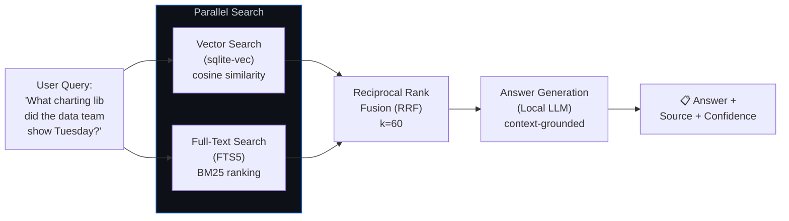

> **Why hybrid search?** Pure vector search excels at semantic similarity ("tools for data visualization") but misses exact terms ("Recharts"). Pure FTS5 catches exact terms but misses synonyms. RRF combines both with zero parameter tuning — each result's score is `1/(k + rank)`, then merged. This is the approach used by leading RAG systems.

---

## 5. Data Pipeline & Temporal Model

The Chronos data flow operates across three distinct temporal stages:

```mermaid
sequenceDiagram
    participant U as 👤 User
    participant CD as 👁️ Capture Daemon
    participant VLM as 🧠 Vision Worker
    participant DB as 💾 SQLite
    participant BE as 📖 Batch Engine
    participant RAG as 🔍 RAG Interface

    rect rgb(13, 17, 23)
    Note over CD,VLM: ⚡ REAL-TIME — Streaming (seconds)

    U->>U: Works normally
    CD->>CD: Detects focus change
    CD->>VLM: Frame (RAM → localhost HTTP)
    VLM->>VLM: Inference via Ollama (GPU/CPU)
    VLM->>DB: INSERT semantic_log (JSON)
    end

    rect rgb(13, 17, 23)
    Note over BE,DB: 🌙 END OF DAY — Batch (minutes)

    BE->>DB: SELECT semantic_logs WHERE date = today
    BE->>BE: Chunk logs - synthesize via LLM
    BE->>DB: INSERT diary_entry (Markdown)
    BE->>DB: Generate embeddings - INSERT vectors
    end

    rect rgb(13, 17, 23)
    Note over RAG,U: 💬 ON DEMAND — Query (milliseconds)

    U->>RAG: "What was discussed in Tuesday's standup?"
    RAG->>DB: Vector search + FTS5 (parallel)
    DB->>RAG: Top-K relevant chunks (RRF merged)
    RAG->>U: Contextualized answer + source citation
    end
```

### 24-Hour Lifecycle

```mermaid
gantt
    title Chronos Data Lifecycle (24 Hours)
    dateFormat HH:mm
    axisFormat %H:%M

    section Capture
        Continuous Capture (RAM only)    :active, cap, 08:00, 18:00

    section Processing
        VLM Inference (streaming)        :active, vlm, 08:00, 18:00

    section Synthesis
        Batch Diary Synthesis            :crit, batch, 18:00, 18:30
        Embedding Generation             :crit, emb, 18:30, 18:45

    section Available
        Query & RAG Ready               :done, rag, 18:45, 23:59
```

---

## 6. Data Model & Storage Budget

### Conceptual Schema

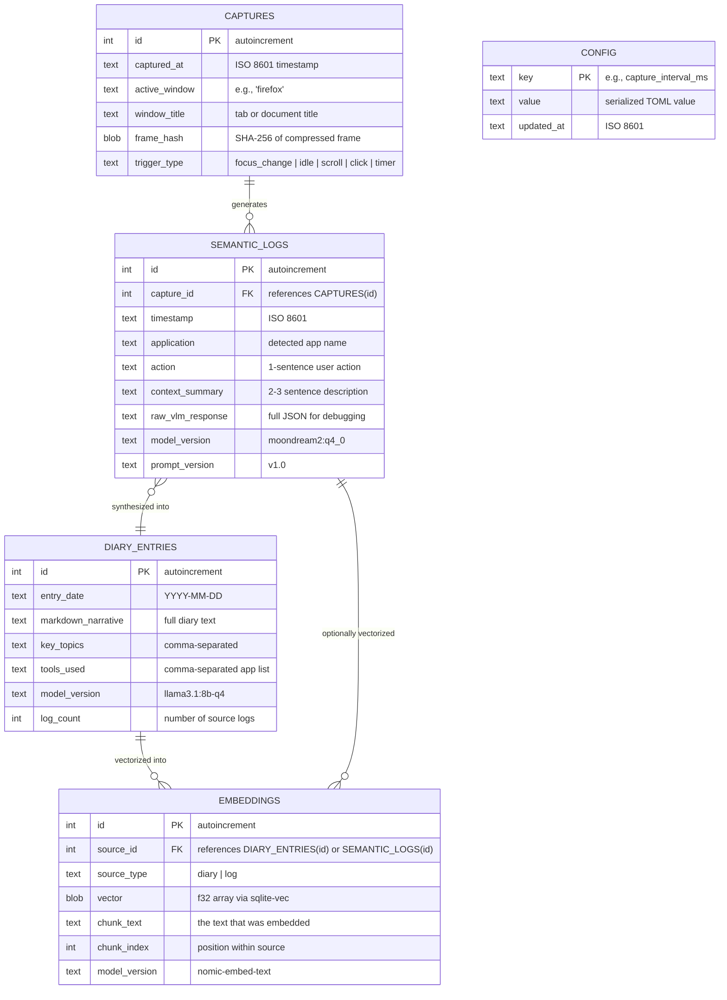

### Storage Budget (per day)

| Data Type | Records | Size per Record | Daily Total | Notes |
|---|---|---|---|---|
| Captured frames | ~2,880 | 0 bytes on disk | **0 bytes** | RAM only; never persisted |
| Frame hashes | ~2,880 | 32 bytes | ~90 KB | SHA-256 for dedup; stored in `CAPTURES` |
| Semantic logs | ~2,880 | ~250 bytes | ~700 KB | JSON fields in SQLite |
| Diary entries | 1 | ~3 KB | ~3 KB | Markdown narrative |
| Embeddings (diary) | ~50–100 chunks | ~3 KB (768 dims × 4 bytes) | ~300 KB | sqlite-vec f32 vectors |
| Embeddings (logs) | Optional | ~1.5 KB (384 dims × 4 bytes) | Up to ~4 MB | Only if real-time search enabled |
| **Daily total** | — | — | **~1–5 MB** | Configurable based on embedding strategy |

> **1 year ≈ 365 MB – 1.8 GB.** Even at maximum verbosity, a decade of usage fits comfortably on any modern SSD. The database file is SQLite — backup is a single `cp` command.

---

## 7. Security & Privacy Model

Privacy is the non-negotiable pillar of Chronos. This section defines the **trust perimeter**, the **data flow restrictions**, and the **compliance posture**.

### Trust Perimeter

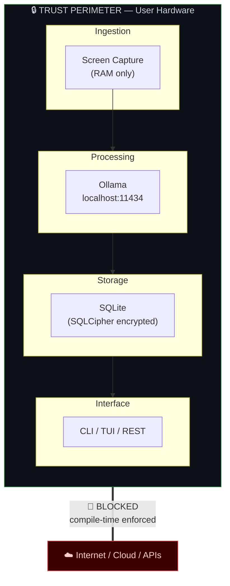

### Privacy Guarantees — Defense in Depth

| Layer | Guarantee | Enforcement Mechanism | Verification |
|---|---|---|---|
| **Network** | Zero data exfiltration | No outbound HTTP; `reqwest` configured with `localhost`-only base URL | CI test: `grep -rn 'http[s]*://' --exclude localhost` fails build |
| **DNS** | No DNS resolution for external hosts | All connections use `127.0.0.1` IP literal, not hostnames | Compile-time constant; no DNS crate dependency |
| **Disk (frames)** | No raw pixels on disk | Circular `VecDeque` in RAM; no `File::create` in capture module | Unit test: assert capture module has zero `std::fs` imports |
| **Disk (database)** | Encrypted at rest | SQLCipher extension; key derived from user passphrase via Argon2 | Integration test: raw file is unreadable without key |
| **Memory** | Frames cleared promptly | Ring buffer overwrites; `zeroize` crate for sensitive fields | `zeroize::Zeroize` trait on `Frame` struct |
| **Code** | Fully auditable | 100% open-source; reproducible builds | CI: `cargo audit`; dependency tree review |
| **User control** | Pause, resume, purge at any time | `chronos pause`, `chronos resume`, `chronos purge --confirm` | Integration test: purge leaves zero rows + securely deletes WAL |

### Data Minimization (Privacy by Design)

Following Cavoukian's seven foundational principles and GDPR Article 25:

| Principle | Application in Chronos |
|---|---|
| **Proactive not Reactive** | Privacy controls designed before any code; no "add privacy later" |
| **Privacy as Default** | Capture OFF until explicitly enabled; all features opt-in |
| **Privacy Embedded in Design** | Trait boundaries physically prevent data leakage (no external HTTP impl) |
| **Full Functionality** | Privacy does not degrade intelligence — same RAG quality, local execution |
| **End-to-End Security** | Argon2 key derivation → SQLCipher AES-256 → `zeroize` on deallocation |
| **Visibility and Transparency** | Open-source code; `chronos audit` command shows all stored data |
| **Respect for User Privacy** | User owns all data; `chronos export` produces portable JSON; `chronos purge` is irreversible |

### Network Isolation — Compile-Time Enforcement

The most critical privacy guarantee — that no data leaves localhost — is enforced at multiple levels:

```rust
// In chronos-core/src/config.rs — compile-time constant
/// The ONLY allowed HTTP host. This is a const, not a config value.
/// Changing this requires modifying source code and recompiling.
pub const ALLOWED_HOST: &str = "127.0.0.1";
pub const OLLAMA_PORT: u16 = 11434;

// In chronos-inference/src/ollama.rs — validated at construction time
impl OllamaClient {
    pub fn new(port: u16) -> Self {
        // URL is hardcoded to localhost — no external endpoint possible
        let base_url = format!("http://{}:{}", ALLOWED_HOST, port);
        Self { client: reqwest::Client::new(), base_url }
    }
}
```

> **Key insight:** There is no configuration variable for an external URL. The localhost constraint is a **compile-time invariant**, not a runtime configuration. An attacker who compromises the config file cannot redirect inference traffic — they would need to recompile the binary.

---

## 8. Local AI Strategy & Crate Selection

### Model Stack

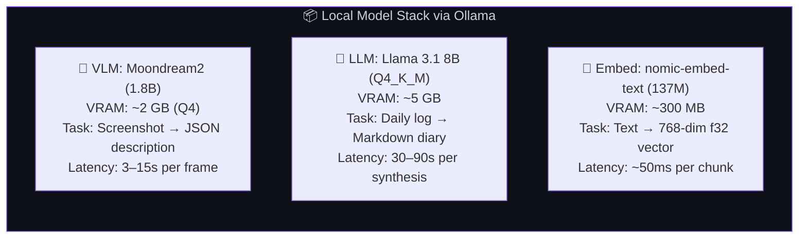

### Hardware Profiles

| Profile | GPU VRAM | CPU | RAM | VLM Performance | Experience |
|---|---|---|---|---|---|
| **Minimum** | None | 4 cores | 8 GB | ~3 frames/min (CPU) | Functional; reduced capture rate |
| **Recommended** | 6 GB (GTX 1660) | 6 cores | 16 GB | ~8 frames/min | Smooth; invisible background operation |
| **Ideal** | 12+ GB (RTX 3060+) | 8+ cores | 32 GB | ~15+ frames/min | Instantaneous; concurrent multi-model |

### Crate Selection & Rationale

| Domain | Crate | Version | Why This Crate |
|---|---|---|---|
| **Async Runtime** | `tokio` | 1.x | Industry standard; mature; multi-threaded scheduler; required by `sqlx` and `reqwest` |
| **HTTP Client** | `reqwest` | 0.12+ | Async; `rustls` backend (no OpenSSL); streaming response support for Ollama |
| **Database** | `sqlx` | 0.8+ | Compile-time SQL validation; async SQLite support; no heavy ORM overhead |
| **Vector Search** | `sqlite-vec` | 0.1+ | SQLite extension; in-process; no separate vector DB server |
| **Full-Text Search** | SQLite FTS5 | built-in | Integrated with SQLite; BM25 ranking; zero dependencies |
| **Encryption** | SQLCipher (via `sqlx` or `libsqlite3-sys`) | — | AES-256-CBC; transparent to application code |
| **Key Derivation** | `argon2` | 0.5+ | Memory-hard KDF; resistant to GPU brute-force; OWASP recommended |
| **Serialization** | `serde` + `serde_json` | 1.x | De facto standard for Rust serialization; zero-copy deserialization |
| **Configuration** | `toml` (via `config` crate) | — | Human-readable; Rust ecosystem standard for config files |
| **CLI** | `clap` | 4.x | Derive macros for declarative CLI; auto-generated help; shell completions |
| **Image Processing** | `image` | 0.25+ | JPEG encoding for frame compression; no system dependency |
| **Screen Capture (X11)** | `xcap` or `scrap` | — | Cross-platform screen capture; X11 and Wayland support |
| **Screen Capture (Wayland)** | `wayland-client` + `xdg-desktop-portal` | — | Portal API for Wayland compositor screenshot access |
| **Tracing / Logging** | `tracing` + `tracing-subscriber` | 0.1+ | Structured logging; span-based; zero-cost when disabled |
| **Sensitive Memory** | `zeroize` | 1.x | Secure memory zeroing; prevents compiler optimization from skipping cleanup |
| **Error Handling** | `thiserror` (library) + `anyhow` (application) | — | `thiserror` for typed errors in library crates; `anyhow` for ergonomic error chains in binary |

> **Go → Rust crate mapping:** `tokio` ≈ Go's goroutine scheduler; `reqwest` ≈ Go's `net/http`; `sqlx` ≈ Go's `database/sql` + `sqlc`; `clap` ≈ Go's `cobra`; `serde` ≈ Go's `encoding/json`; `tracing` ≈ Go's `slog/zerolog`. The key difference: Rust crates enforce correctness at compile time (e.g., `sqlx` validates SQL against the actual schema).

### Why Ollama (Not Candle / llama.cpp Directly)?

| Criterion | Candle (in-process) | llama.cpp (FFI) | Ollama (HTTP) | Decision |
|---|---|---|---|---|
| Setup complexity | High (GPU drivers, model loading) | Medium (FFI bindings) | Low (`ollama pull model`) | Ollama |
| Model management | Manual | Manual | `ollama list`, `ollama pull` | Ollama |
| Multi-model support | One model per process | Complex | Native; warm-keeps models | Ollama |
| Isolation from Chronos | None (crash = Chronos crash) | Partial | Full (separate process) | Ollama |
| Debug productivity | Hard (GPU debugging) | Hard (C++ stack) | Easy (curl, JSON logs) | Ollama |
| Performance overhead | Zero (in-process) | Minimal (FFI) | ~2ms HTTP + JSON | Acceptable |
| Future flexibility | Locked to Rust | Locked to llama.cpp | Swap any GGUF model | Ollama |

> **Trade-off acknowledged:** Ollama adds ~2ms latency per inference call and requires a separate running process. This is an acceptable trade-off for drastically simpler model management, process isolation, and developer productivity. If benchmarks later show this overhead matters (unlikely given VLM latency of 3–15s), we can replace `OllamaVision` with a `CandleVision` struct implementing the same `VisionInference` trait — the core pipeline remains unchanged.

---

## 9. Concurrency Model & Runtime

Chronos uses a hybrid concurrency model: **OS threads for blocking I/O** and **Tokio async tasks for everything else**. This is a deliberate architectural choice, not an accident.

### Why Hybrid (Not Pure Async)?

Screen capture APIs on Linux are inherently **blocking syscalls** — they wait for the compositor to composite a frame. Running these inside a Tokio `async` task would block the entire runtime's thread pool, starving other tasks (HTTP requests, database writes, CLI responses).

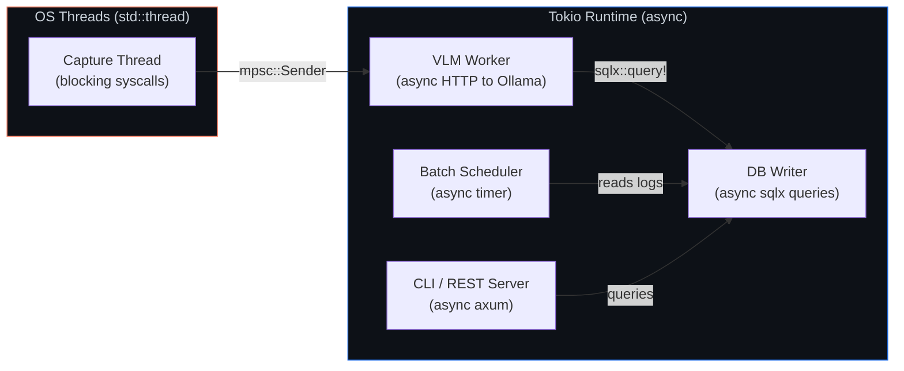

### Runtime Configuration

```rust
// main.rs — Tokio runtime setup
#[tokio::main]
async fn main() -> anyhow::Result<()> {
    // Multi-threaded runtime with sensible defaults.
    // worker_threads defaults to num_cpus, which is correct for our workload.
    // The capture thread is std::thread, so it doesn't consume a Tokio worker.

    let config = Config::load()?;
    let db = Database::connect(&config.database_path).await?;

    // Spawn the capture daemon on a dedicated OS thread.
    // This is intentional: screen capture is a blocking syscall.
    let (frame_tx, frame_rx) = tokio::sync::mpsc::channel::<Frame>(64);
    std::thread::Builder::new()
        .name("chronos-capture".into())
        .spawn(move || capture_loop(config.capture, frame_tx))?;

    // Everything else runs as async tasks on the Tokio runtime.
    let vlm_worker = tokio::spawn(vision_worker(frame_rx, db.clone(), config.vlm));
    let scheduler = tokio::spawn(batch_scheduler(db.clone(), config.synthesis));
    let server = tokio::spawn(start_server(db.clone(), config.server));

    // Await all tasks; crash hard if any fails (fail-fast, not fail-silent).
    tokio::try_join!(vlm_worker, scheduler, server)?;
    Ok(())
}
```

> **Go → Rust mental model:** In Go, every function runs in a goroutine on the Go scheduler. In Rust, you must choose: `std::thread` for blocking work (Go equivalent: `runtime.LockOSThread()`) or `tokio::spawn` for async work (Go equivalent: a goroutine). The Rust compiler will warn you if you accidentally put blocking code in an async context (via `clippy::await_holding_lock` and similar lints).

### Critical Async Edge Cases

| Scenario | Risk | Mitigation |
|---|---|---|
| Blocking in async context | Starves Tokio thread pool; all tasks freeze | Capture runs on `std::thread`; `tokio::task::spawn_blocking` for any other blocking work |
| `mpsc` channel full | Capture thread blocks (backpressure) | Use `try_send` — drop frame and increment metric if channel full |
| Ollama unresponsive | VLM worker hangs indefinitely | `tokio::time::timeout(Duration::from_secs(10), ...)` on every HTTP call |
| SQLite write contention | WAL mode contention under concurrent reads/writes | SQLite WAL mode enabled by default; single writer pattern enforced by `sqlx::SqlitePool` with `max_connections=1` for writes |
| Tokio runtime shutdown | Graceful cleanup needed (flush pending logs) | `tokio::signal::ctrl_c()` handler; drain channels before exit |

---

## 10. User Interfaces

### Step 1: CLI (MVP)

```
$ chronos query "what charting library did the data team show on Tuesday?"

╔══════════════════════════════════════════════════════════════╗
║  📅 Tuesday, March 18, 2026 — 14:32                        ║
║  🪟 App: Google Meet → Chrome                               ║
║                                                              ║
║  During the call with the Data Analytics team,               ║
║  the library "Recharts" for React was presented.             ║
║  The slide showed a comparison between Recharts,             ║
║  Chart.js, and D3.js, recommending Recharts                  ║
║  for its native React component integration.                 ║
║                                                              ║
║  Confidence: 94% | Source: Diary Entry #47                   ║
╚══════════════════════════════════════════════════════════════╝

$ chronos status
Capture: ● Active (1 frame/30s)  |  VLM: ● Moondream2 (GPU)  |  DB: 247 MB
Today: 1,847 logs captured  |  Last synthesis: Mar 19, 2026 18:15

$ chronos purge --before 2026-01-01 --confirm
⚠ Permanently deleted 12,480 logs, 45 diary entries, 3,200 embeddings.
Database vacuumed. WAL file securely zeroed.
```

### Interface Evolution

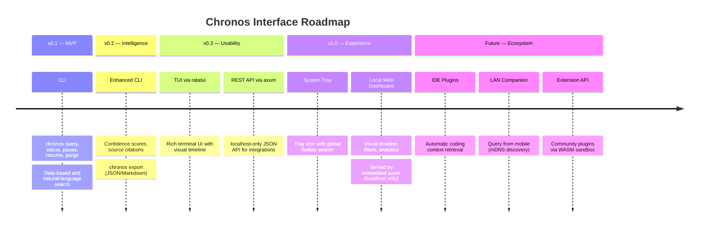

---

## 11. Competitive Analysis

| Feature | **Chronos** | Microsoft Recall | Rewind AI | Manual Notes |
|---|:---:|:---:|:---:|:---:|
| 100% Local Processing | ✅ | ❌ (Azure) | ❌ (Cloud mix) | ✅ |
| Vision AI (VLM) | ✅ | ✅ | ✅ | ❌ |
| Semantic Search (RAG) | ✅ | ✅ | ✅ | ❌ |
| Hybrid Search (Vector + FTS) | ✅ | Unknown | Unknown | ❌ |
| Narrative Diary Synthesis | ✅ | ❌ | ❌ | Manual |
| Open-Source | ✅ | ❌ | ❌ | N/A |
| Monthly AI Cost | **$0** | Bundled (Windows) | **$19.95/mo** | $0 |
| Auditable Privacy | ✅ | ❌ | ❌ | ✅ |
| Works Fully Offline | ✅ | ❌ | ❌ | ✅ |
| Granular Control (pause/purge) | ✅ | Partial | Partial | ✅ |
| Encrypted at Rest (user key) | ✅ (SQLCipher) | Unknown | ❌ | N/A |
| Cross-Platform | Linux → Mac → Win | Windows only | Mac only | N/A |

---

## 12. Roadmap & Evolution

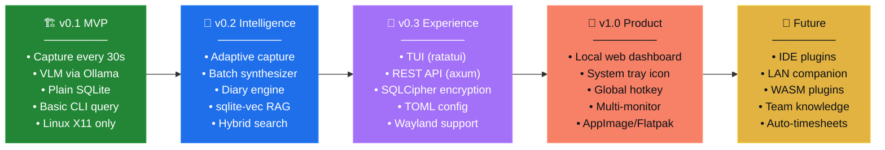

### Step Details

<details>
<summary><strong>v0.1 — MVP / Proof of Concept</strong> (Current Step)</summary>

**Goal:** Validate end-to-end pipeline on a developer Linux machine.

- Screen capture every 30s (X11 via `xcap`)
- VLM inference via Ollama (Moondream2)
- Semantic logs stored in plain SQLite via `sqlx`
- Basic CLI (`chronos query`, `chronos status`) via `clap`
- Comprehensive unit tests with mock capture and mock VLM
- Language: **Rust** — `cargo workspace` with 4 crates

</details>

<details>
<summary><strong>v0.2 — Intelligence</strong></summary>

**Goal:** Transform raw data into actionable knowledge.

- Adaptive capture rate based on window-change heuristics
- Batch synthesizer with local LLM (diary engine)
- Vector embeddings with `sqlite-vec`
- Hybrid search (cosine similarity + FTS5 + RRF)
- `chronos export` for data portability (JSON/Markdown)
- Full integration test suite with Ollama mock server

</details>

<details>
<summary><strong>v0.3 — User Experience</strong></summary>

**Goal:** Make Chronos accessible to non-developers.

- TUI with `ratatui` — visual timeline, search, status
- REST API via `axum` (localhost-only, no auth needed)
- SQLCipher encryption with Argon2 key derivation
- TOML configuration file (`~/.config/chronos/config.toml`)
- Wayland support via `xdg-desktop-portal`
- Systemd service file for auto-start

</details>

<details>
<summary><strong>v1.0 — Complete Product</strong></summary>

**Goal:** Public release, ready for daily use by any professional.

- Local web dashboard (SPA served by embedded `axum`)
- System tray icon with global hotkey search
- Multi-display capture
- One-click installer (AppImage / Flatpak)
- Plugin system (WASM sandbox for community extensions)
- Automated timesheet generation from diary data

</details>

---

## 13. Risk Matrix & Mitigations

| # | Risk | Impact | Likelihood | Mitigation | Status |
|---|---|---|---|---|---|
| R1 | VLMs too slow on CPUs without GPU | Degraded experience; low capture rate | High | Multi-model support; CPU-only mode with reduced rate; `Minimum` profile documented | Open |
| R2 | Inconsistent VLM JSON output | Corrupt or missing semantic logs | Medium | Strict JSON schema validation; regex fallback parser; discard unparseable responses | Open |
| R3 | High RAM from ring buffer | System instability on 8 GB machines | Low | Configurable buffer size (default 64 frames × ~50 KB = ~3 MB); drop oldest frames | Mitigated |
| R4 | Wayland vs X11 fragmentation | Code complexity; two capture backends | High | `ImageCapture` trait; separate `X11Capture` and `WaylandCapture` implementations | Designed |
| R5 | Ollama API breaking changes | Compatibility failure after Ollama update | Medium | Pin minimum Ollama version; regression tests with recorded responses | Open |
| R6 | Public perception as "spyware" | Adoption barrier; negative press | High | Open-source code; independent security audits; transparent documentation; explicit opt-in | Open |
| R7 | SQLite locking under heavy writes | Write failures during concurrent capture + query | Low | WAL mode; single-writer pattern; read-only connection pool for queries | Mitigated |
| R8 | Frame captures during sensitive content (banking, passwords) | Privacy violation of user's own data | Medium | Application-based exclusion list (`~/.config/chronos/exclude.toml`); pause hotkey | Open |
| R9 | Tokio runtime starvation from blocking calls | Entire async pipeline freezes | High | Capture on `std::thread`; `spawn_blocking` for any disk I/O; Clippy lints enforced | Mitigated |
| R10 | Competition from improved Microsoft Recall | Loss of relevance | Medium | Differentiation: radical privacy, open-source, cross-platform, diary synthesis | Accepted |

---

## Appendix A — Architectural Decision Records

### ADR-001: Rust over Go

**Context:** Both Rust and Go are viable for systems-level software. The team has deep Go experience.

**Decision:** Use Rust.

**Rationale:**

| Criterion | Go | Rust | Winner |
|---|---|---|---|
| Memory safety without GC | ❌ (has GC; pauses in real-time pipeline) | ✅ (borrow checker; zero-cost) | Rust |
| Byte-level memory control | Limited | Total (ring buffer, zero-copy) | Rust |
| Compile-time SQL validation | ❌ | ✅ (`sqlx::query!` macro) | Rust |
| Screen capture crate ecosystem | Limited | `xcap`, `scrap`, `wayland-client` | Rust |
| Async + OS thread hybrid | Possible but awkward (`runtime.LockOSThread()`) | Native (`std::thread` + `tokio::spawn`) | Rust |
| Learning curve | Lower for existing team | Higher (borrow checker, lifetimes) | Go |

**Consequences:** Higher initial development cost; lower long-term maintenance cost; zero runtime memory errors; didactic value for the team.

---

### ADR-002: SQLite over PostgreSQL

**Context:** The system needs persistent structured storage + vector search.

**Decision:** Use SQLite with `sqlite-vec` and FTS5 extensions.

**Rationale:**

1. **Zero configuration:** Single file, no daemon, no port, no credentials
2. **Portability:** Database travels with the user (`cp chronos.db /backup/`)
3. **Performance:** For ~1 MB/day write volume, SQLite outperforms any client-server database
4. **Privacy:** No network-accessible server = no open port = smaller attack surface
5. **Vector search:** `sqlite-vec` adds cosine similarity search in-process
6. **Full-text search:** FTS5 provides BM25 ranking with zero additional infrastructure

**Consequences:** Limited to single-writer; no built-in replication. Both are acceptable for a single-user desktop application.

---

### ADR-003: Ollama over Direct Candle/llama.cpp Integration

**Context:** The system needs to run VLM, LLM, and embedding models locally.

**Decision:** Use Ollama via HTTP API.

**Rationale:** See [Section 8](#why-ollama-not-candle--llamacpp-directly) for the full comparison. The ~2ms HTTP overhead is negligible against 3–15s inference latency, and the operational simplicity (model management, process isolation, debug observability) dramatically reduces development friction.

**Consequences:** Ollama is an external dependency that must be installed separately. Mitigated by providing an install script and clear documentation.

---

## Appendix B — Privacy Compliance Matrix

Although Chronos processes only the user's own data on their own hardware, complying with privacy frameworks builds trust and enables future enterprise adoption.

| Framework | Applicability | Chronos Compliance |
|---|---|---|
| **GDPR Article 25** (Data Protection by Design) | If deployed in EU enterprise contexts | ✅ Data minimization, encryption at rest, purpose limitation, right to erasure (`purge`) |
| **CCPA** (California) | If distributed to California users | ✅ Right to delete; right to know (via `chronos audit`); no data sale |
| **LGPD** (Brazil) | If distributed to Brazilian users | ✅ Aligned with GDPR posture; local processing satisfies data localization |
| **HIPAA** | NOT applicable unless processing medical data | ⚠️ Not currently certified, but local-only architecture is a strong foundation |

---

## Appendix C — Glossary

| Term | Definition |
|---|---|
| **VLM** | Vision-Language Model — a neural network that takes an image and produces a text description |
| **FTS5** | SQLite Full-Text Search version 5 — built-in BM25-ranked text search engine |
| **sqlite-vec** | SQLite extension for storing and querying float32 vectors with cosine similarity |
| **GGUF** | GPT-Generated Unified Format — the standard format for quantized LLM/VLM weights used by Ollama and llama.cpp |
| **Q4_K_M** | A 4-bit quantization scheme that balances size, speed, and quality for large language models |
| **RRF** | Reciprocal Rank Fusion — a technique that merges ranked results from multiple search strategies into a single list |
| **SQLCipher** | An open-source extension to SQLite that provides transparent AES-256 encryption |
| **Argon2** | A memory-hard password hashing / key derivation function; winner of the Password Hashing Competition |
| **Ring buffer** | A fixed-size FIFO data structure where the oldest element is overwritten when full |
| **WAL mode** | Write-Ahead Logging — a SQLite journal mode that allows concurrent reads during writes |
| **Back-pressure** | A flow-control mechanism where a slow consumer signals a fast producer to reduce its rate |

---

> *"Chronos is not just a tool — it is the infrastructure for a new category of applications: software that understands what you did, without requiring you to explain."*
