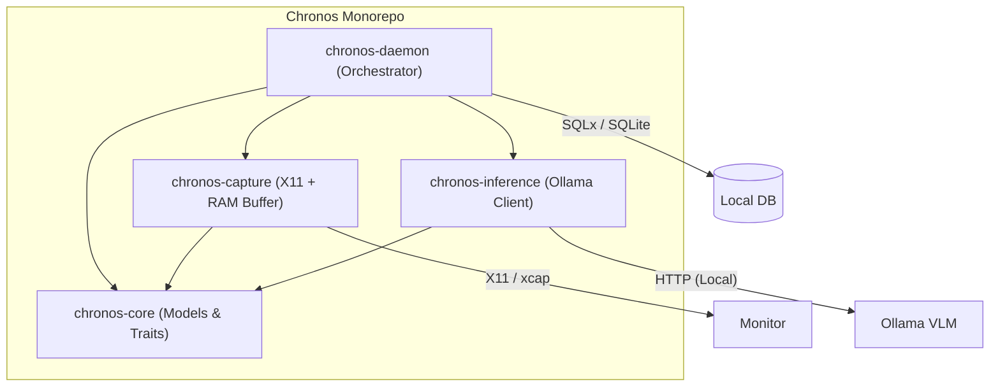
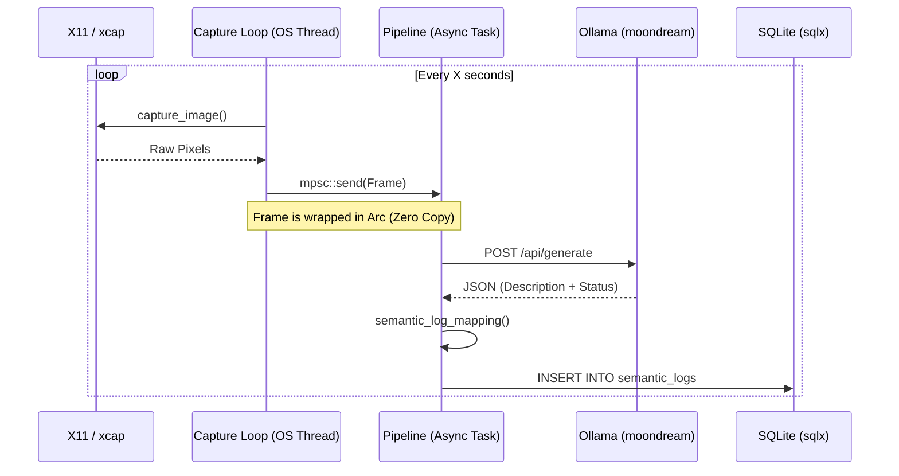

# Deep Dive: Chronos MVP v0.1 Architecture & Rust Paradigms

Welcome to the technical post-mortem and learning guide for the first milestone of **Chronos**. This document is designed for senior engineers transitioning from **Go** to **Rust**, focusing on the "why" behind the architectural choices and how they map to familiar concepts.

---

## 🏗️ High-Level Architecture

Chronos is structured as a **Cargo Workspace** (monorepo), allowing us to maintain clear boundaries between system-level I/O, AI inference, and the core domain logic.



---

## 🧩 Module Breakdown

### 1. `chronos-core`: The Source of Truth
In Go, you might put shared types in a `pkg/models` or `internal/models`. In Rust, we use a dedicated crate to avoid circular dependencies and centralize **Traits** (Interfaces).

- **Rust vs Go:** 
    - **Traits vs Interfaces:** Rust traits are "explicit" (you must `impl Trait for Struct`). Go interfaces are "implicit" (duck typing). Explicit traits allow Rust to perform powerful compile-time optimizations and "monomorphization."
    - **Result/Option:** Instead of `(val, error)`, Rust uses the `Result<T, E>` enum. This forces the caller to handle the error before accessing the value, eliminating a whole class of "nil pointer" bugs common in Go.

### 2. `chronos-capture`: Thread Isolation & RAM Efficiency
This module handles the heavy lifting of pulling pixels from X11.

- **The RAM-Only Ring Buffer:** 
    - **Architecture Rule:** No raw frames on disk.
    - **Implementation:** We used an `Arc<Mutex<VecDeque<Arc<Frame>>>>`. 
    - **Why double `Arc`?** The outer `Arc` allows the buffer to be shared between threads. The inner `Arc<Frame>` ensures that sending a frame to the processing pipeline is "zero-copy"—we just clone the pointer, not the megabytes of image data.
- **Blocking vs Async:**
    - **Go Parallel:** In Go, the scheduler handles blocking syscalls automatically. In Rust/Tokio, a blocking call (like X11's `capture_image`) will starve the entire task executor.
    - **Chronos Solution:** We spawn a **dedicated OS thread** (`std::thread::spawn`) for the capture loop. It communicates with the async world via a `tokio::sync::mpsc` channel. This keeps the "blocking" I/O strictly isolated from the high-performance async orchestration.

### 3. `chronos-inference`: Resilience in Parsing
Directly communicates with Ollama.

- **VLM Hallucination Handling:** LLMs and VLMs are notoriously flaky with JSON. We used `serde`'s `#[serde(default)]` on fields like `confidence_score`. If the VLM forgets the score, Rust gracefully defaults to `0.0` instead of crashing.

### 4. `chronos-daemon`: The Glue
The "Main" entry point.

- **Orchestration:** Uses `tokio::select!` to multiplex between the capture thread, the pipeline processing task, and OS signals (Ctrl+C).
- **Go Parallel:** This is exactly like using a `select` statement with multiple channels and a `ctx.Done()`.

---

## 🔄 Data Flow: The "Semantic Loop"



---

## 💡 Technical Curiosities (Didactic Focus)

### 1. Interior Mutability (`Arc<Mutex<T>>`)
In Go, you often have a struct with a `sync.Mutex`. In Rust, the Mutex *wraps* the data. This means you cannot access the data without locking the mutex, a feature called **Data Race Prevention**. Safe concurrency is a compile-time guarantee in Rust, not a runtime discipline.

### 2. Lifetimes & Ownership
In `chronos-capture`, when we fallback to the first monitor:
```rust
let target = primary.or(first).ok_or(...)?;
```
Rust's ownership rules ensure that `target` is a valid monitor and that the memory for other monitors in the `Vec` is cleaned up correctly as soon as the function returns. No garbage collector is required.

### 3. Error Propagation with `thiserror` & `anyhow`
- **`chronos-core`** defines domain-specific `ChronosError` using `thiserror`. This is for errors we expect and handle.
- **`chronos-daemon`** uses `anyhow` for the top-level main function, allowing us to aggregate different error types (SQL errors, IO errors, Capture errors) into a single path for logging.

---

## 🏁 Summary of v0.1 Status
Chronos today is a robust, private foundation. It proves that you can run computer vision orchestration on Linux using purely local tools without the complexity of a Python environment or the overhead of cloud APIs.

**Happy Hacking!** 🦀✈️
